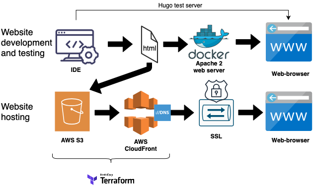
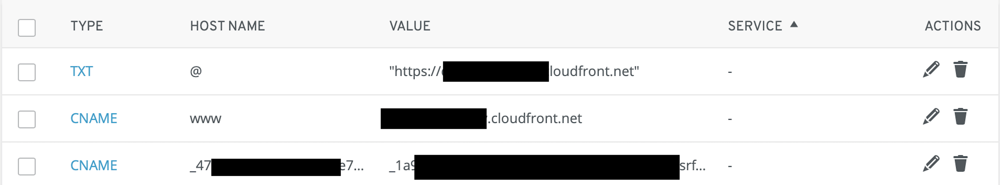

# A static website on AWS using the Jamstack

Using [Huge](https://gohugo.io/) from the [Jamstack](https://jamstack.org/generators/) to create a personal website which is tested using Hugo server and [Apache 2 web server](https://hub.docker.com/_/httpd) via docker. I made use of the template [Hugo Academic](https://themes.gohugo.io/academic/). I registered my domain at [IONOS](https://www.ionos.com/domains/domain-names).

As development enviroment I use [Visual Studio Code](https://code.visualstudio.com) and the VS code add-on [Hugo Language and Syntax Support](https://marketplace.visualstudio.com/items?itemName=budparr.language-hugo-vscode).
## Architecture


## Work flow (MacOS)


1. Install [Hugo](https://gohugo.io/getting-started/installing/) "brew install hugo" 
2. Install an IDE. For example VS code (see above)
3. Clone a template (I used [Academic] (https://github.com/wowchemy/starter-academic))
4. Run "hugo server" for testing
5. Open the website at localhost:1313
6. Develop your website
7. Run "hugo" to build your website
8. Validate your domain name 
7. Create your AWS environment 
8. Upload your website to AWS S3
9. Add you CloudFront distribution domain to your domain


----

## Run a local web server to test the website (optional)
Some of the website functions does not work with the "hugo server" preview and make it necessary to run a web server.

```
docker run -dit --name my-apache-app -p 8080:8088 -v 
"$PWD":/Users/XXXXXX/Documents/Hugo/starter-academic/public httpd:2.4
```


## Using AWS CLI for testing during development (optional)

Copy a test html file to your bucket (optional)

```
aws s3 cp <index.html file path> s3://<name of S3 bucket> --grants read=uri=http://acs.amazonaws.com/groups/global/AllUsers 
```

Deleting all files on S3 (optional)

```
aws rm s3://<name of S3 bucket> --recursive
```
Invalidating CloudFront cache (use when you replace files)

```
aws cloudfront create-invalidation \
    --distribution-id <your CloudFront ID> \
    --paths "/*"

```
---


## Validate your domain name

At [AWS Certificate Manager](https://console.aws.amazon.com/acm/home?region=us-east-1#/firstrun/) click on "Provision certificates". Enter your domain name and choose [DNS validation](https://docs.aws.amazon.com/acm/latest/userguide/gs-acm-validate-dns.html). Add the resulting CNAME information into your domain provider configurations (See an example below).


## Building the infrastructure with Terraform

Edit the areas highlighted in the .tf file in the folder "/terraform-hugo-s3-cloudfront" that it fit your credentials and configurations. It is based on module [Terraform module for hosting Hugo sites on S3 and CloudFront](https://github.com/fillup/terraform-aws-hugo-s3-cloudfront). Terraform will create the web hosting architecture which you can find above.

```
terraform init
terraform apply
```
Terraform will create:

```
# module.hugosite.aws_cloudfront_distribution.hugo
# module.hugosite.aws_s3_bucket.hugo
```
You will get the following message after completion of the terraform code:

```
module.hugosite.aws_cloudfront_distribution.hugo[0]: Creation complete after 2m29s [id=XXXXXXXXXXXXXX]
Apply complete! Resources: 2 added, 0 changed, 0 destroyed.
```

Copy the id into the "z-build-uploadToS3.sh" file (see the script below).

## Transfer html/website files to AWS S3

To copy the files created from Hugo public folder to AWS S3 you can use my developed bash script. See the "z-build-uploadToS3.sh" file and adjust the "bucket-name" which is the bucket name created by the terraform code and the "distributionID" which is the CloudFront ID which can be found via the AWS web-console or is also shown after terraform completed the creation process. Furthermore ensure "profileName" and your profile in ~.aws/credentials are the same.

```
./z-build-uploadToS3.sh
```

Optional you can also just use the AWS CLI to upload the files (see above).


---
## Add you CloudFront distribution domain to your domain

Go to your [CloudFront AWS console] (https://console.aws.amazon.com/cloudfront/home?region=us-east-1#distributions) and take the "Domain Name" e.g. XXXXXXXXXXXXXXX.cloudfront.net and add it as a re-direct in your domain provider of choice (see picture). Your CNAME for DNS validation should also be listed as explained prior.

#### Example of my domain name DNS configurations



When you do a lot of testing with re-directing your domain name to your CloudFront domain you might need to flush your local DNS from time to time. I experienced that during testing I got redirected to a default website with my PC but with my phone it worked as expected. After flushing the DNS it worked (see below).

```
sudo killall -HUP mDNSResponder
```
---

#-> Congratulations!!! Your website is ready to go.

